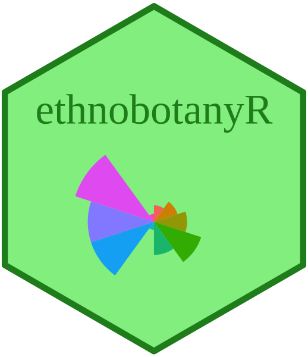

<!-- Spelling -->
<!-- The ABC √ option (upper right on the Rmarkdown console)-->

<!-- Grammar -->
<!-- devtools::install_github("ropenscilabs/gramr") -->
<!-- gramr::run_grammar_checker("vignettes/ethnobotanyr_vignette.rmd") -->

<!-- Print pdf version -->
<!-- rmarkdown::render("vignettes/ethnobotanyr_vignette.Rmd", output_format = "pdf_document") -->

```{r setup, include = FALSE}
knitr::opts_chunk$set(
  collapse = TRUE,
  comment = "#>"
)

library(dplyr)
library(ethnobotanyR)
library(ggplot2)
library(ggridges)
library(magrittr)
# The .bib is not rewritten at build time; regenerate it by hand if packages change
```



Please remember to cite the `ethnobotanyR` package if you use it in your publications. Use `citation("ethnobotanyR")` to get a citation for the latest version.  

```{r cite_ethnobotanyR, comment=NA, echo=FALSE}
citation("ethnobotanyR")
```

## Data

We use `homegardens`, included in the package: plants and their uses in 102 homegardens in southwestern Uganda. Each garden is an informant. The data are described in @whitneyHomegardensFutureFood2017 and analysed in @whitneyEthnobotanyAgrobiodiversityValuation2018. Please cite both papers when you use these data.

Rows are one species in one garden. Columns after `informant` and `sp_name` are the 14 use categories, 0 = not used, 1 = used (same format as `ethnobotanydata`). Gardens only have rows for species they grow, so `n` differs by species.

```{r data_head, echo=FALSE}
knitr::kable(head(homegardens[, 1:8]), caption = "First six rows of the homegardens data (first six use categories shown)")
```

```{r data_dims}
dim(homegardens)
nlevels(homegardens$informant)  # gardens
nlevels(homegardens$sp_name)    # species
```

`homegardens_info` has garden covariates and `homegardens_species` has life form, family and native status.

## Modeling functions

Before modeling, be clear about the aims and objectives, and ground the work in the existing literature. The functions here move from description to uncertainty and shared knowledge:

| Question | Function |
|:--|:--|
| How likely is a use, with uncertainty? | `ethno_beta()` |
| Is the sample large enough? | `ethno_saturation()` |
| Which uses are in the consensus, and who knows most? | `ethno_consensus()` |
| Consensus with competence you set | `ethno_bayes_consensus()` |
| Uncertainty for any statistic | `ethno_boot()` |

### Beta-binomial probability of use

`ethno_beta()` is the default for the probability that a garden growing a species uses it for a purpose. It works for small samples and rare uses.

```{r ethno_beta}
beta_hg <- ethno_beta(homegardens, level = 0.9)
# species grown in at least 50 gardens with the highest use probabilities
beta_hg[beta_hg$n >= 50, ] %>%
  arrange(desc(mean)) %>%
  head(8)
```

Intervals are wide when `n` is small. A species grown in 20 gardens cannot support a precise use probability.

```{r ethno_beta_plot, fig.width=6, fig.height=3.5}
coffee <- beta_hg[beta_hg$sp_name == "Coffea canephora" & beta_hg$k > 0, ]
ggplot(coffee, aes(x = mean, y = reorder(use, mean))) +
  geom_pointrange(aes(xmin = lower, xmax = upper)) +
  labs(x = "Share of gardens using Coffea canephora (90% interval)", y = "")
```

### The non-parametric Bayesian bootstrap

`ethno_boot()` resamples the informants to show how much a statistic could change with different informants. It works for any statistic. Here, how often are avocado (*Persea americana*) and common bean (*Phaseolus vulgaris*) sold?

```{r ethno_boot_uses}
avocado <- homegardens$sale[homegardens$sp_name == "Persea americana"]
bean <- homegardens$sale[homegardens$sp_name == "Phaseolus vulgaris"]

set.seed(1)
avocado_boot <- ethno_boot(avocado, statistic = mean, n1 = 1000)
bean_boot <- ethno_boot(bean, statistic = mean, n1 = 1000)

quantile(avocado_boot, c(0.05, 0.95))
quantile(bean_boot, c(0.05, 0.95))
```

Compare the species with the difference of the paired draws, not by eye:

```{r ethno_boot_diff}
quantile(bean_boot - avocado_boot, c(0.05, 0.95))
mean(bean_boot > avocado_boot)  # probability beans are sold more often
```

```{r plot_boot_ridges, fig.width=7, fig.height=3.5}
boot_long <- data.frame(species = rep(c("Persea americana", "Phaseolus vulgaris"), each = 1000),
                        value = c(avocado_boot, bean_boot))
ggplot(boot_long, aes(x = value, y = species, fill = species)) +
  ggridges::geom_density_ridges() +
  ggridges::theme_ridges() +
  theme(legend.position = "none") +
  labs(y = "", x = "Bayesian bootstrap of the share of gardens selling the plant")
```

The bootstrap only reweights observed values. If no garden reports a use, every draw is zero and the interval has zero width, which is not credible for rare uses. `ethno_boot()` warns in this case; use `ethno_beta()` instead.

```{r ethno_boot_rare}
no_use <- homegardens$hygiene[homegardens$sp_name == "Persea americana"]
sum(no_use)  # no garden reports this use
quantile(ethno_boot(no_use, mean), c(0.05, 0.95))
persea <- ethno_beta(homegardens[homegardens$sp_name == "Persea americana", ])
persea[persea$use == "hygiene", ]
```

### Is the sample large enough?

`ethno_saturation()` shows how many distinct species-use citations each added garden finds. A curve still rising means more gardens would add new species and uses.

```{r ethno_saturation, fig.width=5, fig.height=3.5}
sat <- ethno_saturation(homegardens, n_perm = 100)
ggplot(sat, aes(n_informants, mean)) +
  geom_ribbon(aes(ymin = lower, ymax = upper), alpha = 0.3) +
  geom_line() +
  labs(x = "Gardens", y = "Distinct species-use pairs")
```

The curve is still rising at 102 gardens: new species-use combinations keep appearing.

### Consensus with estimated competence

`ethno_consensus()` estimates each garden's competence from agreement with other gardens across species-use questions, and returns the probability each species-use is in the consensus answer key. It assumes one shared answer key, so minority knowledge counts as error, and it needs enough shared questions. Here we keep the 36 species grown in at least 30 gardens. Gardens that do not grow a species have no answer for it (missing, not zero).

```{r ethno_consensus}
common <- names(which(table(homegardens$sp_name) >= 30))
hg_common <- droplevels(homegardens[homegardens$sp_name %in% common, ])
cons <- ethno_consensus(hg_common)
cons$converged
summary(cons$competence$D)
head(cons$truth[order(-cons$truth$p_used), ], 8)
```

Read the probabilities as ranks, not calibrated certainty: they become extreme as informants are added. Check whether low-competence gardens are a different knowledge group (for example by district) before treating them as error.

```{r competence_district, fig.width=6, fig.height=3.5}
comp <- merge(cons$competence, homegardens_info, by = "informant")
ggplot(comp, aes(district, D)) +
  geom_boxplot() +
  labs(x = "", y = "Estimated competence (D)")
```

### Consensus with fixed competence

`ethno_bayes_consensus()` takes competence from you, one value per row. Here we use the estimates from `ethno_consensus()` for the gardens growing one species. This is the Bayesian consensus for a single species (@oraveczBayesianCulturalConsensus2014; @romneyCultureConsensusTheory1986).

```{r ethno_bayes_consensus}
coffee_data <- hg_common[hg_common$sp_name == "Coffea canephora", ]
coffee_D <- cons$competence$D[match(coffee_data$informant, cons$competence$informant)]
coffee_consensus <- ethno_bayes_consensus(coffee_data, answers = 2,
                                          prior_for_answers = coffee_D)
round(coffee_consensus["1", ], 3)  # probability each use is in the consensus
```

Responses can also be counts: use `answers = 11` for 0 to 10 reports per cell.

### Modeling uses with covariates

`homegardens_info` and `homegardens_species` join to `homegardens`. Does a plant's life form or native status predict medicinal use? Gardens are repeated measures, so a mixed model with a garden random effect is the right tool; `lme4::glmer` is shown if installed.

```{r homegardens_model}
hg <- merge(merge(homegardens, homegardens_species, by = "sp_name"),
            homegardens_info, by = "informant")
hg <- droplevels(hg[hg$type != "Palm", ])  # one palm species: too few to estimate
fit <- glm(medicine ~ type + native + nearest_market_km, data = hg, family = binomial)
round(summary(fit)$coefficients, 2)
```

```{r homegardens_mixed, eval = requireNamespace("lme4", quietly = TRUE)}
fit_mixed <- lme4::glmer(medicine ~ type + native + scale(nearest_market_km) + (1 | informant),
                         data = hg, family = binomial)
round(summary(fit_mixed)$coefficients, 2)
```

For a fully Bayesian version use `brms` with `(1 | informant) + (1 | sp_name)`.

## Summary

Use `ethno_beta()` for honest uncertainty in use probabilities, `ethno_saturation()` to judge sample size, and the consensus functions when you want a shared answer key and informant competence. For the theory behind the consensus models see @oraveczBayesianCulturalConsensus2014 and @romneyCultureConsensusTheory1986. For the descriptive indices see the 'Introduction to ethnobotanyR' vignette. Data: @whitneyHomegardensFutureFood2017 and @whitneyEthnobotanyAgrobiodiversityValuation2018.

## References
