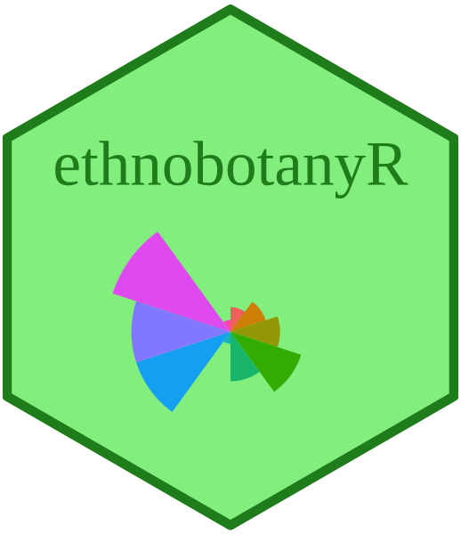

```{r setup, include = FALSE}
knitr::opts_chunk$set(
  collapse = TRUE,
  comment = "#>"
)

load("ethnobotanydata.rda")

# in case of rendering issues render with 
# rmarkdown::render('vignettes/ethnobotanyr_vignette.Rmd', output_file='ethnobotanyr_vignette.html', output_dir='vignettes')

```

# ethnobotanyR 

<p align="center">

</p>


The `ethnobotanyR` package can be used to calculate common quantitative ethnobotany indices to assess the cultural significance of plant species based on informant consensus. The package closely follows two papers, one on cultural importance indices [@tardioCulturalImportanceIndices2008] and another on agrobiodiversity valuation [@whitneyEthnobotanyAgrobiodiversityValuation2018]. The goal is to provide an easy-to-use platform for ethnobotanists to calculate quantitative ethnobotany indices. Users are highly encouraged to familiarize themselves with ethnobotany theory [@gaoue2017; @albuquerqueEthnobotanyOneConcept2010] and social ecological theory [@albuquerqueSocialEcologicalTheoryMaximization2019]. An overview of this theorhetical background will be helpful in understanding approaches in ethnobotany and formulating useful research questions.

An example data set called `ethnobotanydata` is provided to show what the layout for standard ethnobotany data should be formatted to interface with the `ethnobotanyR` package. This is an ethnobotany data set including one column of `r length(unique(ethnobotanydata$informant))` knowledge holder identifiers `informant` and one of `r length(unique(ethnobotanydata$sp_name))` species names `sp_name`. The rest of the columns are the identified ethnobotany use categories. The data in the use categories is populated with counts of uses per person (should be 0 or 1 values). ^[The example `ethnobotanydata` is included with the `ethnobotanyR` package but can also be downloaded from GitHub <https://github.com/CWWhitney/ethnobotanyR/tree/master/data>.]

Many of the functions in `ethnobotanyR` make use of `select()` and `filter_all()` functions of the `dplyr` package [@dplyr] and pipe functions `%>%` from the `magrittr` package [@magrittr]. These are easy to use and understand and allow users the chance to pull the code for these functions and change anything they see fit.

```{r, echo= FALSE}
knitr::kable(head(ethnobotanydata), digits = 2, caption = "First six rows of the example ethnobotany data included with ethnobotanyR")
```

## `ethnobotanyR` package functions

The use report `URs()` function calculates the use report (UR) for each species in the data set. 

\begin{equation}
UR_{s} = \sum_{u=u_1}^{^uNC} \sum_{i=i_1}^{^iN} UR_{ui}
\end{equation}

### Use Report (UR) per species

`URs()` calculates the total uses for the species by all informants (from $i_1$ to $^iN$) within each use-category for that species $(s)$. It is a count of the number of informants who mention each use-category $NC$ for the species and the sum of all uses in each use-category (from $u_1$ to $^uNC$) [see @pranceQuantitativeEthnobotanyCase1987].

```{r URs}
ethnobotanyR::URs(ethnobotanydata)
```

The `URsum()` function calculates the sum of all ethnobotany use reports (UR) for all species in the data set [see @pranceQuantitativeEthnobotanyCase1987].

```{r URsum}
ethnobotanyR::URsum(ethnobotanydata)
```

### Cultural Importance (CI) index

The `CIs()` function calculates the cultural importance index (CI) for each species in the data set.

\begin{equation}
CI_{s} = \sum_{u=u_1}^{^uNC} \sum_{i=i_1}^{^iN} UR_{ui/N}.
\end{equation}

`CIs()` is essentially `URs()` divided by the number of informants to account for the diversity of uses for the species [see @tardioCulturalImportanceIndices2008].

```{r CIs}
ethnobotanyR::CIs(ethnobotanydata)
```

### Frequency of Citation (FC) per species

The `FCs()` function calculates the frequency of citation (FC) for each species in the data set. 

\begin{equation}
FC_s = \sum_{i=i_1}^{^iN}{UR_i}
\end{equation}

`FCs()` is the sum of informants that cite a use for the species [see @pranceQuantitativeEthnobotanyCase1987].

```{r FCs}
ethnobotanyR::FCs(ethnobotanydata)
```

### Number of Uses (NU) per species

The `NUs()` function calculates the number of uses (NU) for each species in the data set.

\begin{equation}
NU_s = \sum_{u=u_1}^{^uNC}
\end{equation}

$NC$ are the number of use categories. `NUs()` is the sum of all categories for which a species is considered useful [see @pranceQuantitativeEthnobotanyCase1987].

```{r NUs}
ethnobotanyR::NUs(ethnobotanydata)
```

### Relative Frequency of Citation (RFC) index

The `RFCs()` function calculates the relative frequency of citation (RFC) for each species in the data set.

\begin{equation}
RFC_s = \frac{FC_s}{N} = \frac{\sum_{i=i_1}^{^iN} UR_i}{N}
\end{equation}

$FC_s$ is the frequency of citation for each species $s$, $UR_i$ are the use reports for all informants $i$ and $N$ is the total number of informants interviewed in the survey [see @tardioCulturalImportanceIndices2008].

```{r RFCs}
ethnobotanyR::RFCs(ethnobotanydata)
```

### Relative Importance (RI) index

The `RIs()` function calculates the relative importance index (RI) for each species in the data set.

\begin{equation}
RI_s = \frac{RFC_{s(max)}+RNU_{s(max)}}{2} 
\end{equation}

$RFC_{s(max)}$ is the relative frequency of citation for the species $s$ over the maximum, $RNU_{s(max)}$ is the relative number of uses for $s$ over the maximum [see @tardioCulturalImportanceIndices2008].

```{r RIs}
ethnobotanyR::RIs(ethnobotanydata)
```

### Use Value (UV) index

The `UVs()` function calculates the use value (UV) index for each species in the data set.

\begin{equation}
UV_{s} =  \sum_{i=i_1}^{^iN} \sum_{u=u_1}^{^uNC} UR_{ui/N} 
\end{equation}

`UVs()` is essentially the same as `CIs()` except that it starts with the sum of UR groupings by informants. $U_i$ is the number of different uses mentioned by each informant $i$ and $N$ is the total number of informants interviewed in the survey [see @tardioCulturalImportanceIndices2008].

```{r UVs}
ethnobotanyR::UVs(ethnobotanydata)
```

The `simple_UVs()` function calculates the simplified use value (UV) index for each species in the data set.

\begin{equation}
UV_{s} = \sum U_i/N
\end{equation}

$U_i$ is the number of different uses mentioned by each informant $i$ and $N$ is the total number of informants interviewed in the survey [see @albuquerque2006].

### Cultural Value (CVe) for ethnospecies 

The `CVe()` function calculates the cultural value (CVe) for ethnospecies. The index is one of three proposed for assessing the cultural, practical and economic dimensions (ethno) species importance. Reyes-Garcia et al. (2006) suggest several more indices but $CV_e$ is the most commonly used from that study [@ReyesGarcia2006].

\begin{equation}
CV_{e} = {Uc_{e}}  \cdot{IC_{e}}  \cdot \sum {IUc_{e}}
\end{equation}

Where $UC_e$ is the number of uses reported for ethnospecies $e$ divided by all potential uses of an ethnospecies considered in the study. $Ic_e$ expresses the number of informants who listed the ethnospecies $e$ as useful divided by the total number of informants. $IUc_e$ expresses the number of informants who mentioned each use of the ethnospecies $e$ divided by the total number of informants [see @ReyesGarcia2006].

```{r CVe}
ethnobotanyR::CVe(ethnobotanydata)
```

### Fidelity Level (FL) per species 

The `FLs()` function calculates the fidelity level (FL) per species in the study. It is a way of calculating the percentage of informants who use a plant for the same purpose as compared to all uses of all plants.

\begin{equation}
FL_{s} = \frac {N_{s}}{UR_{s}}
\end{equation}

where $N_s$ is the number of informants that use a particular plant for a specific purpose, and $UR_s$ is the total number of use reports for the species [see @friedmanPreliminaryClassificationHealing1986]. 

```{r FLs}
ethnobotanyR::FLs(ethnobotanydata)
```

Divide FLs by 100 to get the percent FL, as it is reported in some studies.

## Visualize `ethnobotanyR` results

The `Radial_plot` function shows these results as a radial bar plot for quick assessment of the result using the `ggplot2` library.

```{r, fig.width=7, fig.height=7}
ethnobotanyR::Radial_plot(ethnobotanydata, ethnobotanyR::URs)
```

The `cowplot` package [@cowplot] can also be used with `Radial_plot` to show several indices together for easy comparison.

```{r, fig.width=7, fig.height=7}
URs_plot <- ethnobotanyR::Radial_plot(ethnobotanydata, ethnobotanyR::URs)

NUs_plot <- ethnobotanyR::Radial_plot(ethnobotanydata, ethnobotanyR::NUs)

FCs_plot <- ethnobotanyR::Radial_plot(ethnobotanydata, ethnobotanyR::FCs)

CIs_plot <- ethnobotanyR::Radial_plot(ethnobotanydata, ethnobotanyR::CIs)

cowplot::plot_grid(URs_plot, NUs_plot, FCs_plot, CIs_plot, 
    labels = c('URs', 'NUs', 'FCs', 'CIs'), 
    nrow = 2, 
    align="hv",
    label_size = 12)
```

## `ethnobotanyR` chord diagrams with `circlize`

The following chord plots are made using functions from the `circlize` package [@circlize]. An example of the application of chord plots in ethnobotany is described in a study on agrobiodiversity in Uganda [@whitneyEthnobotanyAgrobiodiversityValuation2018]. 

The `ethnoChord()` function creates a chord diagram of ethnobotany uses and species.

```{r, fig.width=7, fig.height=7}
Chord_sp <- ethnobotanyR::ethnoChord(ethnobotanydata, by = "sp_name")
```

The `ethnoChord()` function can also be used to create a chord diagram of ethnobotany uses and informants.

```{r, fig.width=7, fig.height=7}
Chord_informant <- ethnobotanyR::ethnoChord(ethnobotanydata, by = "informant")
```


## References

